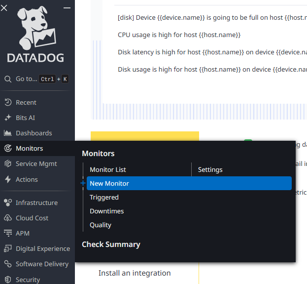
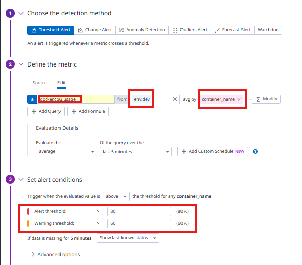
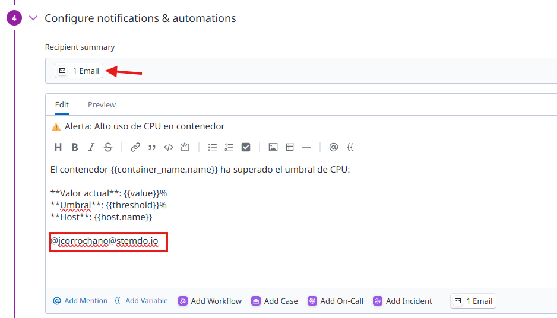
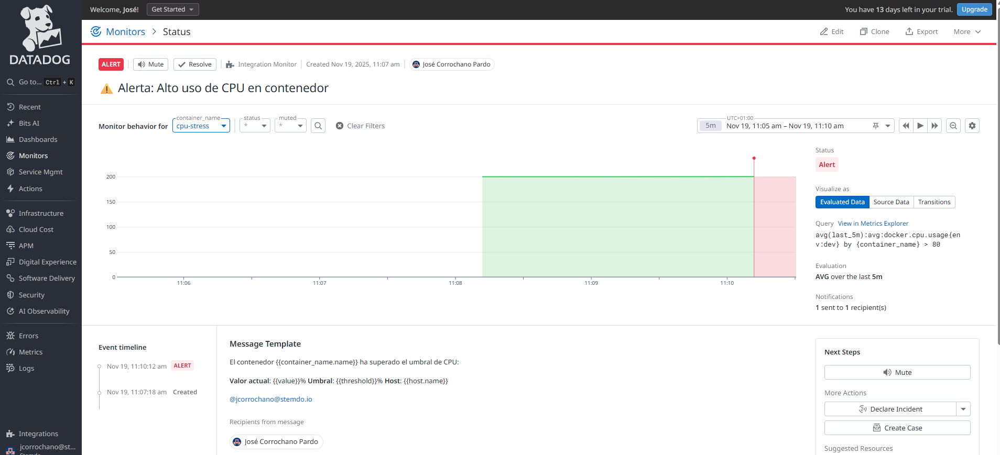
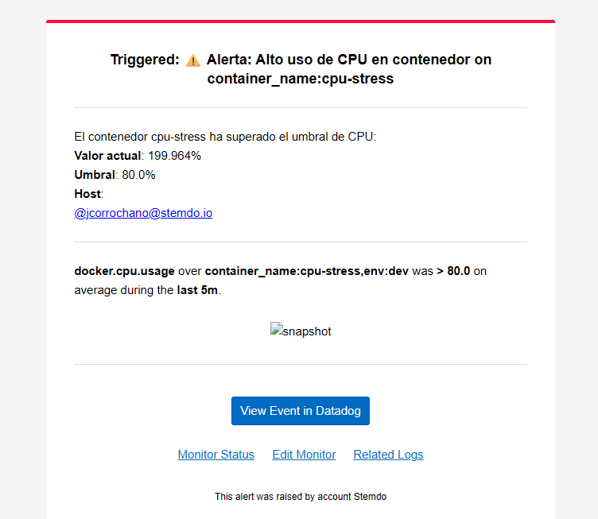

# Alertas y Notificaciones

Crea tu primera alerta configurando un monitor que te notifique cuando el uso de CPU de un contenedor supere el 80% durante 5 minutos. Configura la alerta para que envíe notificaciones por email. Genera carga artificial en un contenedor para probar que la alerta funciona correctamente.

---

## Crear un monitor de CPU

- Accedemos a la interfaz de Datadog y en el menú lateral seleccionamos **Monitors > New Monitor**:

    

## Configurar la métrica y condiciones

- En la sección **"Define the metric"**, configuramos la métrica de CPU de contenedores:

    ```
    docker.cpu.usage
    ```

    Esta métrica mide el porcentaje de CPU utilizado por cada contenedor.

    - **avg by**: `container_name` (para identificar qué contenedor tiene alto uso de CPU)
    - **Evaluation window**: `last 5 minutes` (evalúa el promedio de los últimos 5 minutos)

- En la sección **"Set alert conditions"** establecemos los umbrales:

    - **Alert threshold**: `80` (se activará la alerta cuando el uso de CPU supere el 80%)
    - **Warning threshold**: `60` (advertencia previa cuando supere el 60%)

    Esto permite detectar problemas de rendimiento antes de que se vuelvan críticos.

    

## Configurar notificaciones por email

- En la sección **"Configure notifications & automations"** añadimos el mensaje de la alerta:

    ```
    El contenedor {{container_name.name}} ha superado el umbral de CPU:

    **Valor actual**: {{value}}%
    **Umbral**: {{threshold}}%
    **Host**: {{host.name}}

    Por favor, revisa el contenedor inmediatamente.

    @jcorrochano@stemdo.io
    ```

    El formato `@email` activa el envío automático de notificaciones por correo electrónico cuando se dispara la alerta.

- Le damos un nombre descriptivo al monitor:

    ```
    Alerta: Alto uso de CPU en contenedor
    ```

    

- Guardamos el monitor haciendo clic en **"Create"**.

## Generar carga artificial para probar la alerta

Para verificar que la alerta funciona correctamente, generamos carga de CPU usando un contenedor especializado:

```bash
docker run -d --name cpu-stress \
  --label com.datadoghq.tags.service="stress-test" \
  containerstack/cpustress --cpu 2 --timeout 600s
```

Este comando:
- Crea un contenedor llamado `cpu-stress`
- Genera carga en 2 cores de CPU durante 600 segundos (10 minutos)
- Añade el tag `service:stress-test` para identificarlo fácilmente en Datadog

## Verificar el funcionamiento de la alerta

- Esperamos entre 5-7 minutos para que el monitor acumule datos suficientes y detecte el alto uso de CPU.

- El monitor cambia de estado **"OK"** (verde) a **"ALERT"** (rojo) cuando detecta que el CPU supera el 80% durante 5 minutos:

    

    La gráfica muestra claramente la transición de la zona verde (por debajo del umbral) a la zona roja (por encima del 80%).

- Recibimos un email con los detalles de la alerta:

    

    El email incluye:
    - **Título** de la alerta
    - **Contenedor afectado**: `cpu-stress`
    - **Valor actual** de CPU: 199.964%
    - **Umbral configurado**: 80.0%
    - **Enlace directo** al monitor en Datadog para más detalles
    - **Gráfico** mostrando la evolución de la métrica

---

## Automatizar con Terraform

Una vez que ya se sabe como crearlo a mano con la interfaz de Datadog, es hora de hacerlo con terraform.

Teniendo todo configurado lanzamos el terraform apply:

```bash
terraform apply
```

Podemos encontrar el código de terraform en el siguiente enlace:

[Código de Terraform](../iac/alerta)

