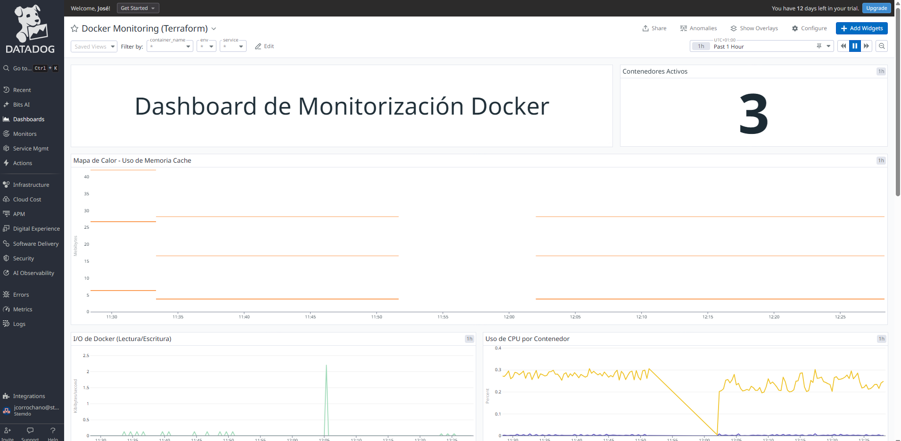

# Dashboards Avanzados y Correlación

Crea un dashboard completo que correlacione métricas de infraestructura (CPU, memoria, red) con logs de aplicación y eventos de Docker (start, stop, destroy). Usa variables de plantilla para hacer el dashboard dinámico y poder filtrar por host o contenedor. Practica el uso de funciones de agregación y visualizaciones avanzadas.

---

## Descripción del Dashboard

El dashboard incluye los siguientes widgets de visualización:

### 1. **Contenedores Activos**
Widget de valor numérico que muestra el número total de contenedores Docker en ejecución, filtrable por entorno. Ideal para obtener una vista rápida del estado general del sistema.

### 2. **Mapa de Calor - Uso de Memoria Cache**
Visualización tipo heatmap que muestra el consumo de memoria caché de los contenedores a lo largo del tiempo. Permite identificar patrones de uso y picos de memoria de forma visual e intuitiva.

### 3. **I/O de Docker (Lectura/Escritura)**
Gráfica de series temporales que representa las operaciones de lectura y escritura en bytes de cada contenedor. Útil para detectar cuellos de botella en operaciones de disco y analizar el rendimiento de I/O.

### 4. **Uso de CPU por Contenedor**
Serie temporal que muestra el porcentaje de uso de CPU de cada contenedor en tiempo real. Permite identificar contenedores que están consumiendo recursos excesivos.

### 5. **Top 5 - Uso de CPU**
Lista ordenada de los 5 contenedores con mayor consumo de CPU. Facilita la identificación rápida de los servicios que requieren más recursos de procesamiento.

### 6. **Uso de Memoria (RSS y Cache)**
Gráfica que compara el uso de memoria RSS (memoria física utilizada) y memoria caché por contenedor. Esencial para el análisis de consumo de memoria y detección de fugas.

### 7. **Logs de Contenedores Docker**
Stream en tiempo real de los logs generados por los contenedores (nginx, redis, postgres), con campos configurables como timestamp, nombre del contenedor, servicio, fuente y contenido del log.

### 8. **Eventos Docker**
Lista de eventos del sistema Docker como arranques, paradas y reinicios de contenedores. Útil para auditoría y troubleshooting de incidentes.

### Variables de Template
El dashboard incluye tres variables de filtrado dinámico:
- **container_name**: Filtra por nombre de contenedor específico
- **env**: Filtra por entorno (dev, prod, staging)
- **service**: Filtra por tipo de servicio (web, cache, database)

## Configuración del Agente de Datadog

**Antes de ejecutar Terraform**, es necesario configurar el agente de Datadog para que recopile logs de los contenedores Docker. Ejecuta los siguientes comandos:

### 1. Habilitar la recolección de logs

```bash
sudo sed -i 's/^# logs_enabled: false/logs_enabled: true/' /etc/datadog-agent/datadog.yaml
```

Este comando activa la funcionalidad de recolección de logs en el agente de Datadog, necesaria para que el widget de logs funcione correctamente.

### 2. Configurar logs_config

```bash
sudo sed -i 's/^# logs_config:/logs_config:/' /etc/datadog-agent/datadog.yaml
```

Habilita la sección de configuración de logs en el archivo principal del agente.

### 3. Habilitar la recolección automática de logs de contenedores

```bash
sudo sed -i '/logs_config:/,/container_collect_all:/ s/^#   container_collect_all: false/  container_collect_all: true/' /etc/datadog-agent/datadog.yaml
```

Este comando configura el agente para que recopile automáticamente los logs de **todos** los contenedores Docker en ejecución, sin necesidad de configuración individual por contenedor.

### 4. Aplicar los cambios

```bash
sudo systemctl daemon-reload
sudo systemctl restart datadog-agent
```

Recarga la configuración de systemd y reinicia el agente de Datadog para aplicar todos los cambios realizados.

***

## Despliegue del Dashboard con Terraform

Una vez ya tenemos todo configurado lanzamos el terraform apply:

```bash
terraform apply
```

Podemos encontrar el código de terraform en el siguiente enlace:

[Código de Terraform](../iac/dashboard-docker)

### 5. Acceder al Dashboard

Una vez completado el despliegue, accede a Datadog y navega a **Dashboards**. Encontrarás el dashboard con el nombre **"Docker Monitoring (Terraform)"**.

## Resultado Final

Una vez desplegado, el dashboard mostrará todas las métricas, logs y eventos de tus contenedores Docker en tiempo real, con la capacidad de filtrar y agrupar datos usando las variables de template configuradas.


