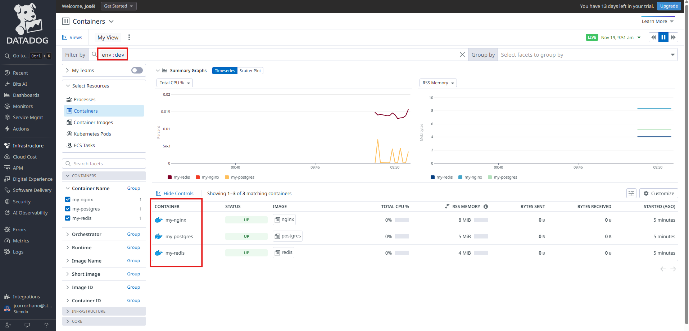
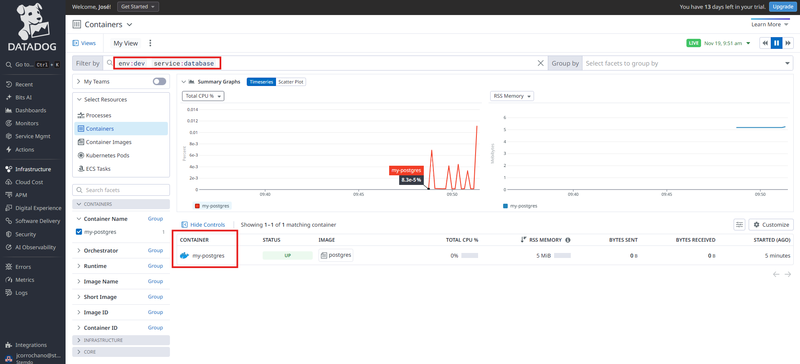

# Monitorización de Contenedores Docker

Instala Docker en tu servidor Ubuntu y despliega 2-3 contenedores simples (nginx, redis, postgres). Configura el agente de Datadog para monitorizar Docker añadiendo el usuario dd-agent al grupo docker y creando el archivo de configuración en /etc/datadog-agent/conf.d/docker.d/conf.yaml. Observa las métricas de cada contenedor y familiarízate con el uso de tags para filtrar datos.

---

## Preparación del entorno

- Primero descargamos las imágenes de Docker que vamos a usar para los contenedores:

    ```bash
    docker pull nginx
    docker pull redis
    docker pull postgres
    ```

    Esto descarga las imágenes oficiales de nginx (servidor web), redis (base de datos en memoria) y postgres (base de datos relacional) desde Docker Hub.

## Instalación del agente de Datadog

- Instalamos el agente de Datadog en nuestro entorno WSL con las variables de configuración necesarias:

    ```bash
    DD_API_KEY="7246f0..." \
    DD_SITE="datadoghq.eu" \
    DD_HOSTNAME="wsl-ubuntu-docker" \
    DD_TAGS="env:dev,project:docker-monitoring,owner:jcorrochano" \
    DD_ENV="dev" \
    bash -c "$(curl -L https://install.datadoghq.com/scripts/install_script_agent7.sh)"
    ```

    Las variables definen:
    - `DD_API_KEY`: Nuestra clave de API de Datadog
    - `DD_SITE`: El sitio europeo de Datadog (datadoghq.eu)
    - `DD_HOSTNAME`: Un nombre fijo para identificar la máquina
    - `DD_TAGS`: Etiquetas a nivel de host para organizar las métricas
    - `DD_ENV`: Define el entorno como desarrollo

## Configuración de permisos Docker

- Añadimos el usuario `dd-agent` al grupo `docker` para que el agente pueda acceder al socket de Docker:

    ```bash
    sudo usermod -aG docker dd-agent
    ```

    Esto es necesario porque Docker usa un socket Unix (`/var/run/docker.sock`) que solo pueden usar usuarios del grupo `docker`.

## Configuración de la integración Docker

- Creamos el directorio para la configuración de Docker en Datadog:

    ```bash
    sudo mkdir -p /etc/datadog-agent/conf.d/docker.d/
    ```

- Creamos el archivo de configuración:

    ```bash
    sudo nano /etc/datadog-agent/conf.d/docker.d/conf.yaml
    ```

    Con el siguiente contenido:

    ```yaml
    init_config:

    instances:
      - url: "unix://var/run/docker.sock"
        collect_container_size: true
        collect_images_stats: true
        collect_labels_as_tags:
          com.datadoghq.tags.service: service
    ```

    Este archivo le indica al agente:
    - Dónde encontrar el socket de Docker
    - Que recopile estadísticas de tamaño de contenedores e imágenes
    - Que extraiga los labels `com.datadoghq.tags.service` como tags de Datadog

- Reiniciamos el agente para aplicar la configuración:

    ```bash
    sudo systemctl restart datadog-agent
    ```

## Despliegue de contenedores con tags

- Desplegamos el contenedor de Nginx con el tag `service:web`:

    ```bash
    docker run -d --name my-nginx \
      --label com.datadoghq.tags.service="web" \
      -p 80:80 nginx
    ```

    El flag `--label` añade metadatos que Datadog usará para etiquetar las métricas del contenedor.

- Desplegamos el contenedor de Redis con el tag `service:cache`:

    ```bash
    docker run -d --name my-redis \
      --label com.datadoghq.tags.service="cache" \
      -p 6379:6379 redis
    ```

- Desplegamos el contenedor de Postgres con el tag `service:database`:

    ```bash
    docker run -d --name my-postgres \
      --label com.datadoghq.tags.service="database" \
      -e POSTGRES_PASSWORD=postgres \
      -p 5432:5432 postgres
    ```

## Verificación

- Comprobamos que el agente está funcionando correctamente:

    ```bash
    sudo systemctl status datadog-agent
    ```

    Debería aparecer como `active (running)`.

## Visualización en Datadog

- Accedemos a la interfaz de Datadog navegando a `Infrastructure > Containers`:

    

    Aquí podemos ver los 3 contenedores desplegados (my-nginx, my-redis, my-postgres) junto con sus métricas en tiempo real.

- Utilizamos el filtro "Filter by" para buscar contenedores por el tag `service`:

    

    Al escribir `service:` aparecen las opciones: `service:web`, `service:cache`, `service:database`.

- Seleccionamos "Group by" para agrupar los contenedores por el tag `service`:

    

    Esto permite organizar los contenedores por categorías y comparar métricas entre servicios del mismo tipo.

