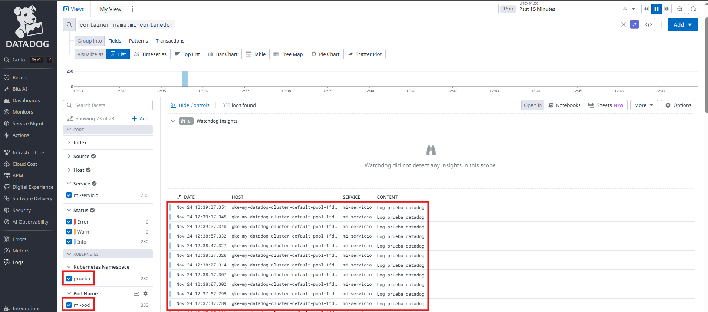

# Instalación del Agente de Datadog en un Pod Específico

Este documento muestra cómo preparar el entorno y configurar el agente de Datadog para que **solo recoja logs** en los pods/contenedores que tú marques mediante anotaciones, evitando la recolección global en todos los pods del clúster.[1]

---

## 1. Autenticación con Google Cloud

```bash
gcloud auth login jcorrochano@stemdo.io
gcloud config set account jcorrochano@stemdo.io
gcloud auth list
```
Estos comandos permiten iniciar sesión en Google Cloud y establecer la cuenta activa.

---

## 2. Configuración del clúster Kubernetes

```bash
gcloud container clusters get-credentials my-datadog-cluster --zone=us-south1-b --project=balmy-mile-452912-p6
kubectl get nodes
```
Con esto configuras el acceso seguro a tu clúster GKE y compruebas la conexión con los nodos.

---

## 3. Configurar anotaciones para el pod/contenedor específico

Para habilitar la recolección **selectiva** de logs por Datadog, debes añadir una anotación por cada contenedor que quieres monitorizar. Así en tu manifiesto, bajo metadata:

```yaml
metadata:
  name: mi-pod
  labels:
    app: mi-pod
  annotations:
    ad.datadoghq.com/enabled: "true"
    ad.datadoghq.com/mi-contenedor.logs: '[{"source": "custom", "service": "mi-servicio"}]'
    ad.datadoghq.com/otro-contenedor.logs: '[{"source": "custom", "service": "otro-servicio"}]'
```

En el bloque `spec.containers`, cada `name:` coincide con la anotación. Ejemplo:

```yaml
spec:
  containers:
  - name: mi-contenedor
    image: busybox
    command: ["sh", "-c", "while true; do echo 'Log prueba datadog'; sleep 10; done"]
  - name: otro-contenedor
    image: busybox
    command: ["sh", "-c", "while true; do echo 'Log otro datadog'; sleep 15; done"]
```
Así Datadog identifica, recibe y etiqueta por separado los logs de cada contenedor.

---

## 4. Crear namespace y desplegar el pod

```bash
kubectl create namespace prueba
kubectl apply -f mi-pod.yaml -n prueba
kubectl get pods -n prueba
```
Esto prepara el entorno y pone en funcionamiento el pod monitorizable.

---

## 5. Crear namespace Datadog e instalar el agente

```bash
kubectl create namespace datadog
helm install datadog-agent datadog/datadog \
  --namespace datadog \
  --set datadog.apiKey=$DD_API_KEY \
  --set datadog.site=datadoghq.eu \
  --set datadog.logs.enabled=true \
  --set datadog.logs.containerCollectAll=false \
  --set datadog.logs.containerCollectUsingFiles=true \
  --set datadog.apm.enabled=true \
  --set datadog.processAgent.enabled=true \
  --set datadog.containerExclude="name:datadog-agent" \
  --set datadog.tags[0]="env:gke" \
  --set datadog.tags[1]="project:datadog-monitoring" \
  --set datadog.tags[2]="owner:jcorrochano"
```
Esto instala el agente en modo **selectivo**: solo recolectará los logs de los pods/contenedores que tengan los annotations correctos.[1]

---

## 6. Conceder permisos RBAC al agente

Se edita el ClusterRole para que el agente pueda acceder a los pods y logs en todo el cluster:

```yaml
# Añadir esto al final del array rules:
- apiGroups:
  - ""
  resources:
  - pods
  - pods/log
  - namespaces
  - events
  verbs:
  - get
  - list
  - watch
```
Con `kubectl edit clusterrole datadog-agent` usa `i` para insertar, `Esc` para salir del modo edición, luego escribe `:wq` y Enter para guardar y cerrar.

---

## 7. Validar la instalación

En Datadog, accede al panel **Log Explorer** y filtra por el nombre del pod y del servicio configurado en la anotación. Deberías ver únicamente los logs de los pods que tengan la anotación, los otros no aparecerán.




