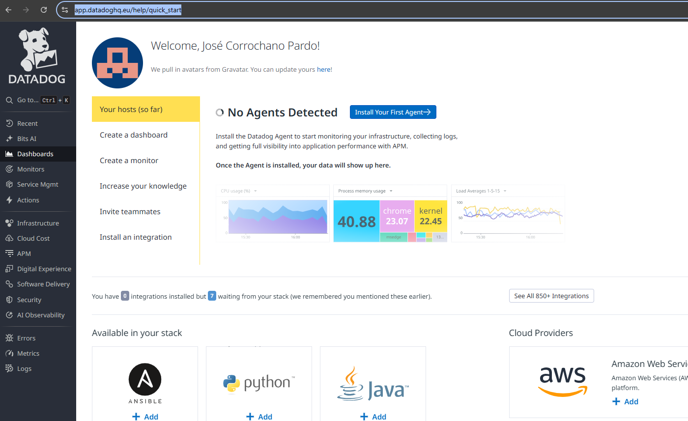
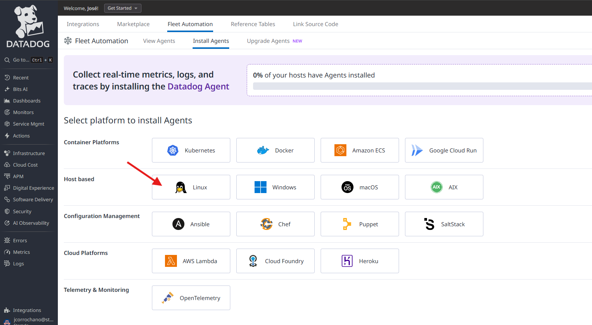
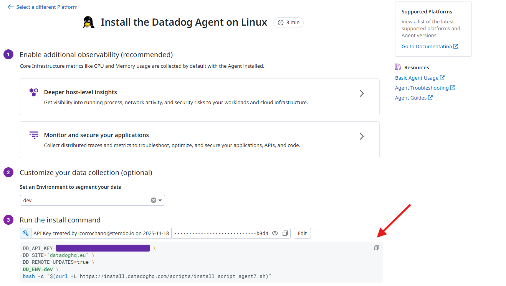
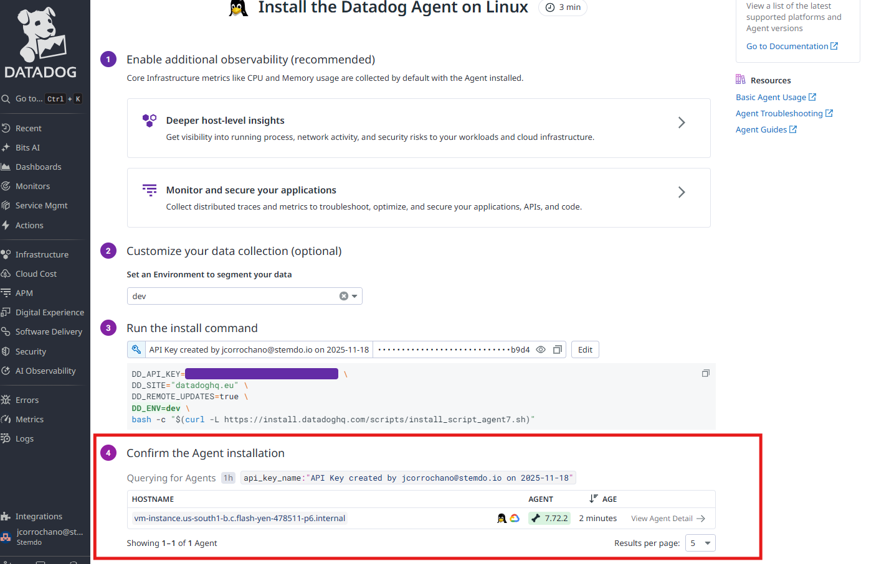
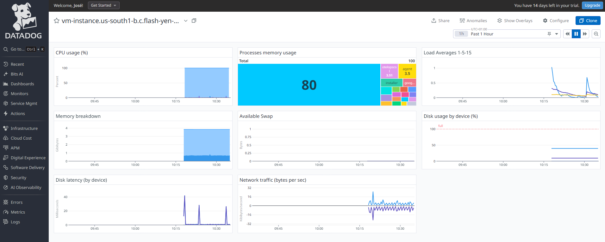
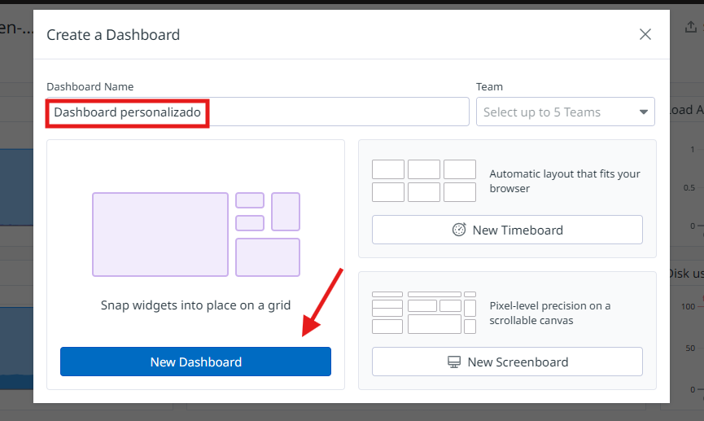
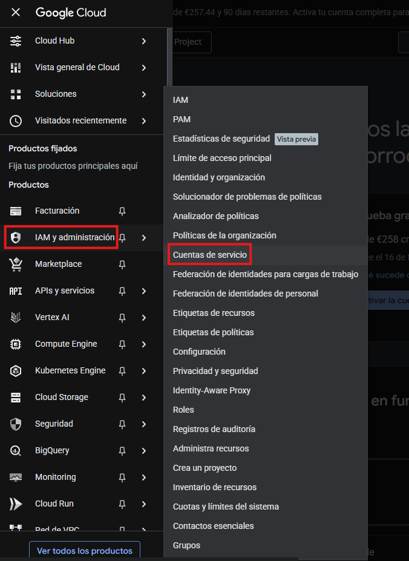
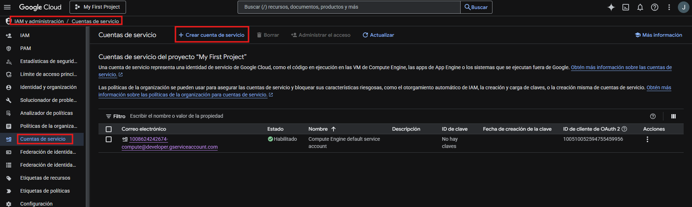
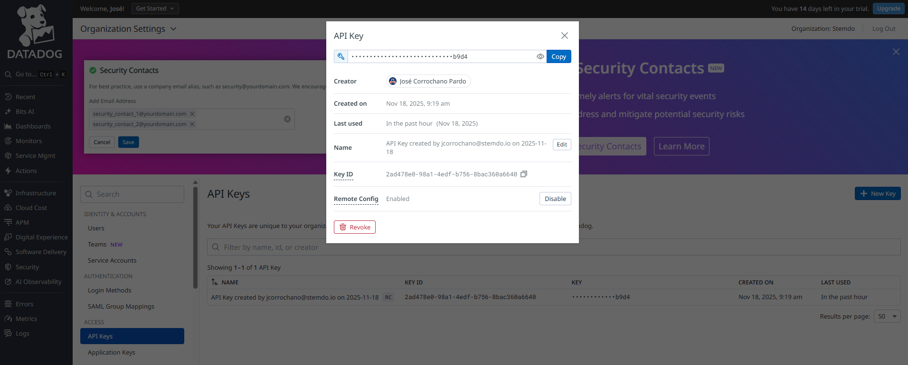
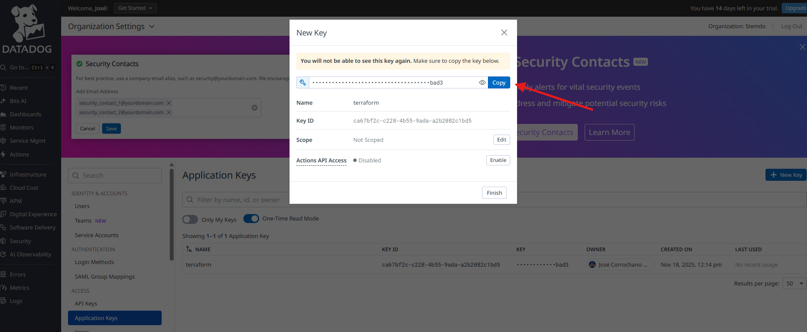

# Instalación y Primeras Métricas

## Crear Dashboard con Datadog

Crea una cuenta gratuita en Datadog, obtén tu API key e instala el agente en una VM de Ubuntu. Verifica que el dashboard muestra métricas básicas de CPU, memoria y disco de tu servidor. Configura tu primer dashboard personalizado con 4-5 widgets mostrando estas métricas.

---

- Nos conectamos a una máquina virtual de Google Cloud a través de ssh:

    ```bash
    gcloud compute ssh vm-instance --zone us-south1-b
    ```

- Con nuestra cuenta de datadog ya creada, accedemos a la siguiente página:

    ```bash
    https://app.datadoghq.eu/help/quick_start
    ```

    

- Seleccionamos el botón de "Install Your First Agent":

    

- Elegimos la plataforma donde vamos a instalar nuestro agente, en este caso "Linux":

    

- Depués de esto, se nos abre una nueva pestaña en donde primero tenemos que hacer click en "Select API key":

    

- Una vez configurada nuestra API key copiamos el comando que nos viene y lo ejecutamos en nuestra máquina virtual:

    

- Cuando se haya instalado el agante dentro de nuestra máquina comprobamos que el agente está corriendo:

    ```bash
    sudo systemctl status datadog-agent
    ```

- También se verá en el portal de datadog:

    

- Ahora para revisar las métricas de nuestra instancia podemos irnos en el panel izquierdo a "Infrastructure > Host Map":

    

- Podemos ver las métricas principales en el resumen del host:

    

- Si pinchamos en "Dashboard" podemos ver las gráficas de CPU, memoria, disco, carga y red en tiempo real:

    

- Ahora para crear un Dashboard personalizado vamos a "Dashboard > New Dashboard"

    

- Le ponemos un nombre y lo creamos:

    

- Seleccionamos el tipo de widget "Timeseries" para añadir gráficos:

    

- Guardamos el primer widget con las métricas de CPU:

    

- Y así con 4 widgets más hasta que tengamos un dashboard completo con todos los widgets:

    

- A continuación se muestra una tabla resumen con las métricas más importantes para monitorizar una VM en un dashboard personalizado, y el motivo de incluir cada una:

| Métrica            | Para qué sirve                           | Nombre típico en Datadog                     |
| ------------------ | ---------------------------------------- | -------------------------------------------- |
| Uso de CPU (%)     | Detectar carga excesiva o picos          | `system.cpu.user`, `system.cpu.idle`             |
| Memoria usada      | Chequear consumo y posibles saturaciones | `system.mem.used`, `system.mem.pct_usable`       |
| Disco usado (%)    | Ver espacio ocupado y alertas de llenado | `system.disk.used`, `system.disk.in_use`         |
| Carga media (Load) | Vigilar sobrecarga y rendimiento         | `system.load.1`, `system.load.5`                 |
| Tráfico de red     | Detectar problemas de red o saturación   | `system.net.bytes_rcvd`, `system.net.bytes_sent` |
| Latencia de disco  | Revisar fallos de almacenamiento         | `system.disk.latency`                          |
| Swap usada         | Saber si hay falta de memoria RAM        | `system.swap.used`, `system.swap.free`           |
| Procesos activos   | Controlar procesos consumiendo recursos  | `system.proc.count`                            |

---

## Automatizar Dashboard con Terraform

Una vez ya se sabe como crear un dashboard personalizado a mano con la interfaz de Datadog, es hora de hacerlo con terraform.

Para ello voy a crear primero una máquina virtual en Google Cloud e instalar ahí el agente.

### Configuración de claves

Antes de escribir el código, hace falta consultar una serie de claves.

- Primero (si no la tenemos ya) hay que crear una cuenta de servicio dentro de Google Cloud:

    

    

    

    

- Una vez tenemos la cuenta de servicio, creamos la clave en formato archivo JSON que será el que nos permita conctarnos a Google Cloud:

    

    > El archivo que se nos decarga es el que tenemos que indicar más adelante a terraform para autenticarnos con Google Cloud

- También habrá que sacar el ID del proyecto:
  
    

- Por la parte de Datadog hay que consgeuir primero la API Key:
  
    

- Y también la APP Key (Puede ser necesario crearla):
  
    

    

---

### Despliegue

Una vez ya tenemos todo configurado lanzamos el terraform apply:

```bash
terraform apply
```


    
    

